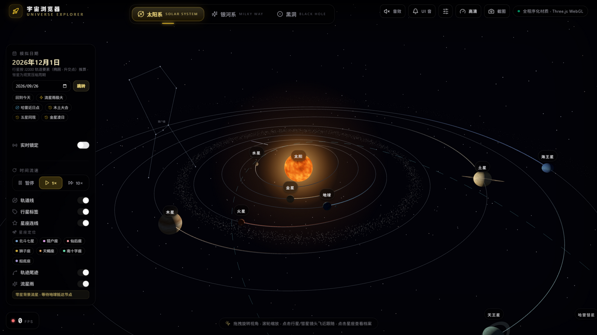
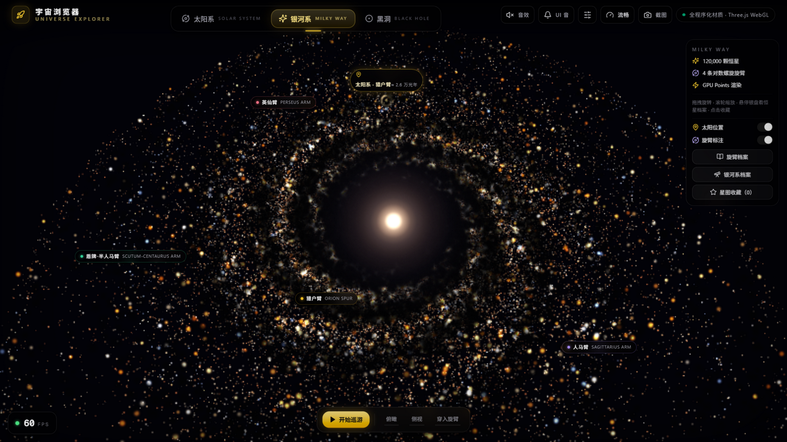
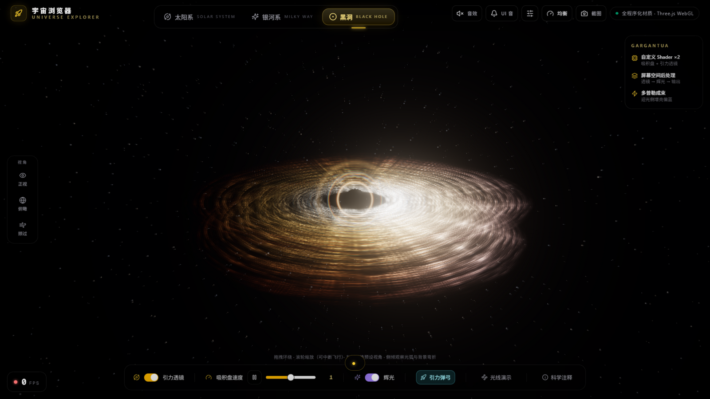
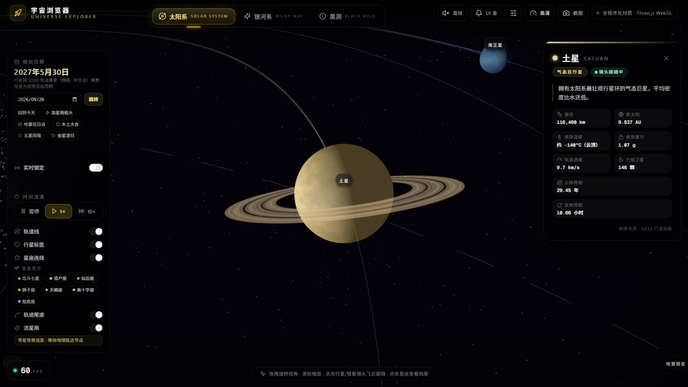

English | [简体中文](README.md)

# 🔭 Universe — Universe Browser

A single-page immersive universe exploration app built with **Next.js + Three.js**. Four scenes — **Solar System / Milky Way / Black Hole / Zodiac** — rendered entirely with procedurally generated materials and particle systems, no external image assets. Roam from planetary orbits to the event horizon, right in your browser.

     

## 📸 Screenshots

| Solar System — real J2000 orbits + constellations | Milky Way — 120,000 stars + four labeled arms |
|---|---|
|  |  |

| Black Hole — lensed Doppler-boosted accretion disk | Click a planet → camera fly-to + fact card |
|---|---|
|  |  |

## ✨ Three Scenes

### 🪐 Solar System
- **8 planets with real motion**: orbital + spin rates proportional to actual NASA periods (faster closer to the Sun), real orbital and axial tilts (Uranus lies on its side at 97.8°)
- **Real J2000 orbital elements**: elliptical orbits (true eccentricity) + ascending nodes + perihelion longitudes; Kepler's equation solved by Newton iteration — any calendar date maps to the real planetary configuration
- **Date simulator**: jump to any date (1900–2100), quick buttons for "Today / Meteor shower peak / Halley perihelion", plus real-time lock (1 second = 1 second of real motion)
- **Planetary alignment detector**: live detection of 4–5 planet clumping, one-click jumps to historical sky events (2020 Jupiter-Saturn great conjunction, 2012 Venus transit, etc.)
- **Halley's Comet**: true-eccentricity orbit with dual tails (ion + dust), visibly accelerating at perihelion
- **Asteroid belt + Kuiper belt**: 6,100 particles on Keplerian differential rotation
- **7 real constellations**: Big Dipper / Orion / Cassiopeia / Leo / Scorpius / Crux / Carina (J2000 RA/Dec) with fact cards, Canvas star charts and camera fly-to
- **Orionids meteor shower demo**: meteor intensity peaks (Gaussian window) as Earth crosses Halley's debris trail
- **Click-to-follow camera**: fact card pops up while the camera flies in and keeps tracking the planet's orbit; closing the card releases it
- Orbit trails, planet labels with screen-space collision avoidance, time speed (pause / 1× / 10×), orbit-line toggle

### 🌌 Milky Way
- **120,000 GPU point stars**: 4 log-spiral arms, blackbody temperature colors (red → blue-white), 26,000 dark dust particles forming dust lanes, bright core + purple halo
- **Three-stage auto tour (24s)**: top-down → side view → dive into the arms; user input takes over anytime
- **Sun position marker**: amber pulsing marker on the Orion Spur, ≈26,000 light-years out
- **Four-arm science labels** + Milky Way fact sheet (diameter / star count / galactic year / Sagittarius A* — 9 facts)
- **Star hover profiles**: spatial-index accelerated lookup showing spectral class / type / arm / distance from galactic center
- **Personal star bookmarks**: click to bookmark stars (localStorage, named after BeiDou star officials), with fly-to and JSON export/import

### ♈ Zodiac
- **The twelve ecliptic constellations** on a sky sphere: real J2000 star positions, magnitude-graded stars, stick figures and classic asterisms like the Sagittarius Teapot
- **Golden ecliptic ring** + live Sun-position marker (solar longitude computed from today's date — "Sun in Libra")
- Click a sign: camera focus flight + profile card (date range, color-coded element, ruling planet, brightest star and mythology, fully bilingual)
- Twelve quick-focus chips along the top

### 🕳️ Black Hole
- **Custom shader accretion disk**: thin inner / thick outer profile, Keplerian differential rotation, fbm filaments, temperature ramp, **Doppler beaming** (one side brighter and bluer), white-hot inner edge — Interstellar style
- **Screen-space gravitational lensing post-processing**: bent background starfield, photon ring, RGB dispersion, Einstein ring glow, smooth toggle
- **Real general-relativity ray demo**: Schwarzschild null geodesics integrated with RK4 — four rays with different impact parameters show deflection / photon-sphere orbiting / horizon capture (critical parameter b = 3√3/2 · Rs)
- **Gravity slingshot demo**: N-body two-body hyperbolic flyby with a live comet-tail trail
- **Time dilation calculator**: drag the distance-from-horizon slider for a live √(1−Rs/r) readout
- Science annotation card, camera presets (front / top / skim), "breathing" shimmer while paused

## 🎛️ Global Features

- 🌍 **Bilingual UI (zh/en)**: follows the device language automatically; switchable in the settings panel (中文 / English / follow device), Canvas labels redraw on switch
- ⚙️ **Settings panel**: language switching + performance tuning (quality presets, FPS governor toggle, pixel-ratio cap) + shortcut cheat sheet (`,` to open)
- 🪟 **Collapsible panels**: each scene's control panel collapses into a floating pill so small screens can see the full scene
- ✨ **Origin-aware one-shot transitions**: dialogs and cards open from the exact tap point and close back into it — no jump cuts
- 🎨 Dark space-themed UI, glassmorphism cards, fully procedural materials (zero external images)
- 📸 One-click screenshot download (including post-processing)
- 🖥️ Four quality presets (HD / Balanced / Light / Smooth, incl. a 62.5% step) + **bidirectional FPS-adaptive governor** (auto downshift at low FPS, auto recovery with headroom; manual choice always wins)
- 🔊 Fully synthesized Web Audio: per-scene ambient drones + UI event sounds with independent volume sliders
- ⌨️ Shortcuts: `1/2/3/4` switch scenes · `M` master mute · `Space` pause the solar system · `,` settings · `Esc` (zodiac: return to overview)
- 🎬 **Cinematic scene travel**: the outgoing scene recedes into a point while the next grows from the depths (zoom-through, no jump cuts)
- 📱 Mobile-ready: two-row portrait header, 44px touch targets, safe-area insets, pinch zoom
- Bottom-left FPS badge (click/hover for render info)

## 🚀 Quick Start

Requires Node.js ≥ 20 (works on Windows / macOS / Linux — tested on Windows with Node 26).

```bash
# 1. Install dependencies
npm install

# 2. Development mode (port 3000)
npm run dev

# 3. Production build + start (standalone output; the script copies static assets automatically)
npm run build
npm run start
```

Open [http://localhost:3000](http://localhost:3000) and start exploring.

> - Build/start scripts are cross-platform (`scripts/copy-standalone.mjs` copies static assets into the standalone output); npm, pnpm, yarn and bun all work.
> - In mainland China, a mirror speeds up installs: `npm install --registry=https://registry.npmmirror.com`
> - All three scenes are WebGL-heavy; desktop Chrome/Edge/Firefox recommended. Quality is downgraded automatically at low frame rates.

## 📁 Project Structure

```
src/
├── app/
│   ├── page.tsx              # Mounts UniverseBrowser
│   └── layout.tsx            # Global layout + viewport
├── components/
│   ├── ui/                   # shadcn/ui components
│   └── universe/             # ⭐ core modules
│       ├── UniverseBrowser.tsx    # Shared shell: header / scene tabs / FPS / audio / quality
│       ├── SolarSystemScene.tsx   # Solar system scene
│       ├── GalaxyScene.tsx        # Milky Way scene
│       ├── BlackHoleScene.tsx     # Black hole scene
│       ├── planetData.ts          # NASA facts + J2000 orbital elements
│       ├── proceduralTextures.ts  # Procedural textures (planet surfaces / rings / glows)
│       ├── galaxyShaders.ts       # Milky Way GLSL shaders
│       ├── blackHoleShaders.ts    # Accretion disk GLSL shaders
│       ├── lensingPass.ts         # Gravitational lensing post-processing pass
│       ├── quality.ts             # Quality presets + FPS-adaptive governor
│       ├── soundscape.ts          # Web Audio synthesized soundscape engine
│       ├── capture.ts             # Scene screenshot registry
│       └── fps.ts                 # FPS meter (direct DOM writes, zero React re-renders)
└── lib/utils.ts              # Utilities

scripts/
└── copy-standalone.mjs       # Copies static assets into the standalone output after build

docs/screenshots/             # Screenshots used by the README
```

## 🛠️ Tech Stack

| Category | Technology |
|---|---|
| Framework | Next.js 16 (App Router) + React 19 + TypeScript |
| 3D rendering | Three.js 0.186 (native API, hand-written render loops) |
| Shaders | Custom GLSL (star particles / accretion disk / gravitational lensing post-processing) |
| UI | Tailwind CSS 4 + shadcn/ui + lucide-react |
| Physics | Kepler equation numerical solving (Newton iteration), Schwarzschild null geodesic RK4 integration, N-body two-body simulation |
| Audio | Fully procedural Web Audio synthesis |
| Data | NASA planetary fact sheet, JPL J2000.0 orbital elements, Hipparcos star coordinates |

## 🤖 Acknowledgements

This project was developed by the [GLM-5.3](https://z.ai) (Z.ai) large language model — including all three scenes, 44 feature iterations, the shaders and physics simulations, and this repository's build configuration.

## 📜 License

[Apache License 2.0](LICENSE)
